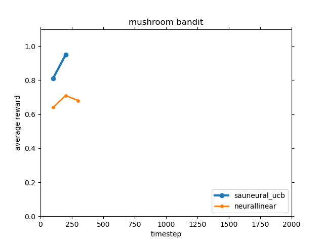

# SAU-Exploration

This is the project site for the paper
> Rong Zhu and Mattia Rigotti, "Deep Bandits Show-Off: Simple and Efficient Exploration with Deep Networks", in Advances in Neural Information Processing Systems 34 (NeurIPS), Dec. 2021 [[arXiv:2105.04683](https://arxiv.org/abs/2105.04683)]

We introduce **SAU-exploration**, an exploration method for the bandit framework with strong theoretical guarantees in the *Multi-Armed Bandit* setting and very efficient implementation in the contextual bandit setting.
In combination with a *deep neural networks*, SAU-exploration gives rise to a very simple and efficient deep contextual bandit algorithm that achieves higher rewards than state-of-the-art Bayesian algorithms like *Neural Linear* (a neural network with an exact linear posterior classifier introduced by [Riquelme et al., ICLR, 2018]), but is as fast as a neural network with -greedy exploration.




## Requirements
* Python 3.6 or above
* PyTorch 1.6.0
* Numpy 1.19.1
* SciPy 1.5.2
* Matplotlib 3.3.4

These can be installed using `pip` by running:

```bash
>> pip install -r requirements.txt
```


## Code usage

Let's look at a basic example of how to use the code (which you can execute with the jupyter notebook [run_basic_example.ipynb](https://github.com/IBM/sau-explore/blob/master/run_basic_example.ipynb) in the repository.
In this example we will use *SAU-Neural-UCB* (SAU-UCB combined with at Neural Network) to tackle the the *Statlog bandit problem*, a contextual bandit problem based on the Shuttle Statlog Dataset in the UCI machine learning repository:


```python
BANDIT_NAME = "statlog"
AGENT_NAME = "sauneural_ucb"
TIME_STEPS = 1000
```

Let us import the functions to load pre-implemented *contextual bandit problems* and *agents* (learning algorithms), and the *Deep Contextual Bandit Trainer* (which includes the architecture):


```python
from run_bandit_experiment import load_agent, load_bandit
from lgenrl import DCBTrainer
```

Let us now load the Statlog bandit (which will also download the dataset is it's not already present in the folder `~/data/statlog`), load the SAU-Neural-UCB exploration algorithm, instantiated a trainer and use it to deploy the exploration algorithm:


```python
bandit = load_bandit(BANDIT_NAME, download=True)
agent = load_agent(BANDIT_NAME, AGENT_NAME)

trainer = DCBTrainer(agent, bandit, logdir="./logs/example")
results = trainer.train(
    timesteps=TIME_STEPS, batch_size=64, update_after=20, update_interval=20, train_epochs=10
)
```


    Started at 25-10-21 14:50:48
    Training SAUNeuralAgent on StatlogDataBandit for 1000 timesteps
    timestep    regret    reward    cumulative_regret  cumulative_reward  regret_moving_avg  reward_moving_avg
    100         0         1         39                 61                 0.2                0.8
    200         0         1         60                 140                0.2                0.8
    300         0         1         62                 238                0.04               0.96
    400         0         1         66                 334                0.02               0.98
    500         0         1         68                 432                0.0                1.0
    600         0         1         68                 532                0.0                1.0
    700         0         1         69                 631                0.02               0.98
    800         0         1         72                 728                0.04               0.96
    900         0         1         73                 827                0.0                1.0
    1000        0         1         74                 926                0.0                1.0
    Training completed in 0 seconds
    Final Regret Moving Average: 0.0 | Final Reward Moving Average: 1.0


Let us now finally look at the results by plotting the *average reward* (averaged over a moving window of 10 time steps) as a function of time step, and at the *average regret*:


```python
import matplotlib.pyplot as plt

plt.subplot(2,1,1)
plt.title(f"Algorithm {AGENT_NAME} on {BANDIT_NAME} bandit", fontsize=14)

plt.plot(results['reward_moving_avgs'])
plt.ylabel('average reward', fontsize=14)
plt.xlabel('steps', fontsize=14)

plt.subplot(2,1,2)
plt.plot(results['regret_moving_avgs'])
plt.ylabel('average regret', fontsize=14)
plt.xlabel('steps', fontsize=14)

plt.tight_layout()
plt.show()
```


### Paper results

The script `run_bandit_experiment.py` reproduces the main deep contextual bandit results of the paper:


```bash
>> python run_bandit_experiment.py --help
```

```bash
Usage: run_bandit_experiment.py [-h] [--agent AGENT] [--bandit BANDIT]
                                [--delta DELTA] [--run RUN]
                                [--experiment EXPERIMENT] [--use_cuda]
                                [--download]

Deep Contextual Bandit Experiments

optional arguments:
  -h, --help            show this help message and exit
  --agent AGENT         name of bandit algorithm (options: linear|neurallinear
                        |lineargreedy|neuralgreedy|saulinear_sampling|saulinea
                        r_ucb|sauneural_sampling|sauneural_ucb|uniform)
  --bandit BANDIT       name of bandit dataset (options: mushroom|statlog|cove
                        rtype|adult|financial|jester|census|wheel)
  --delta DELTA         delta parameter of the wheel bandit between 0.0 and
                        1.0 (it is ignored if bandit is not wheel)
  --run RUN             run number
  --experiment EXPERIMENT
                        tells program to run an experiment (starts from 1,
                        corresponding to a combination of bandit x agent x
                        run)
  --use_cuda            enables CUDA training
  --download            download datasets if missing
```
